# Asp.net-ITForum
Asp.net个人作品，IT技术分享论坛

### 登录页面
验证码由代码生成，将结果放到Session
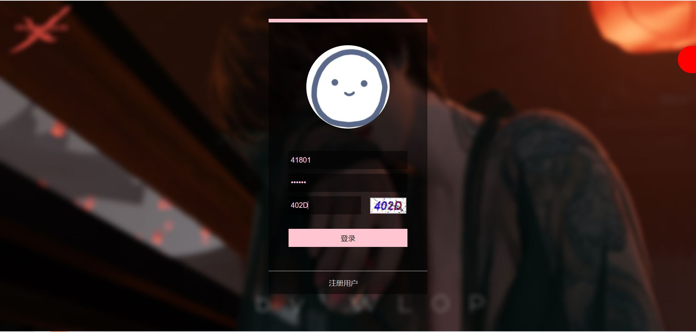

### 注册页面
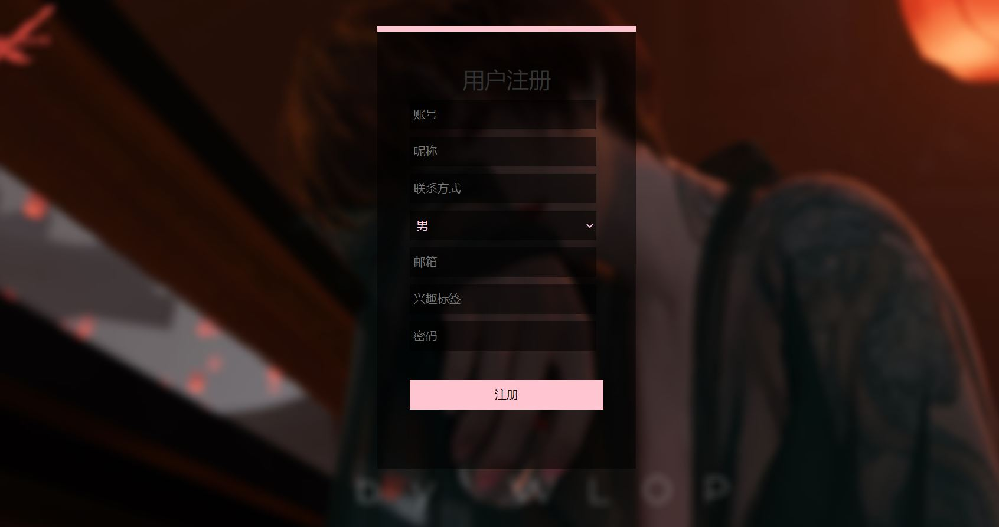

### 首页
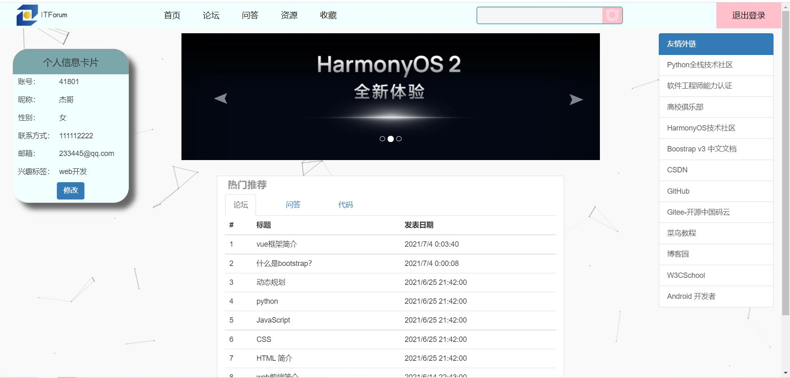

### 修改个人信息（模态框）
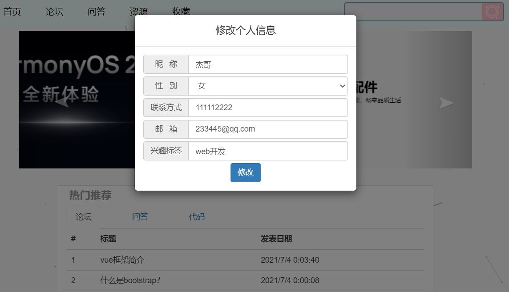

### “论坛”页面
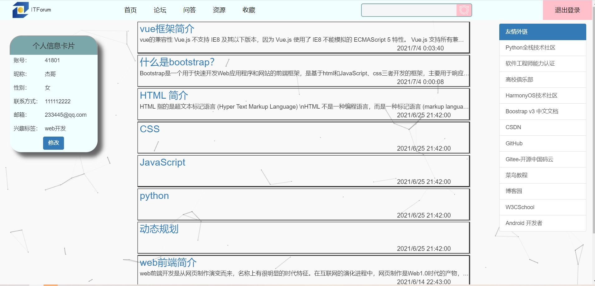

### “问答”页面

### 点击某个问答/论坛进入后的页面
可对问答/论坛进行点赞收藏、评论的操作
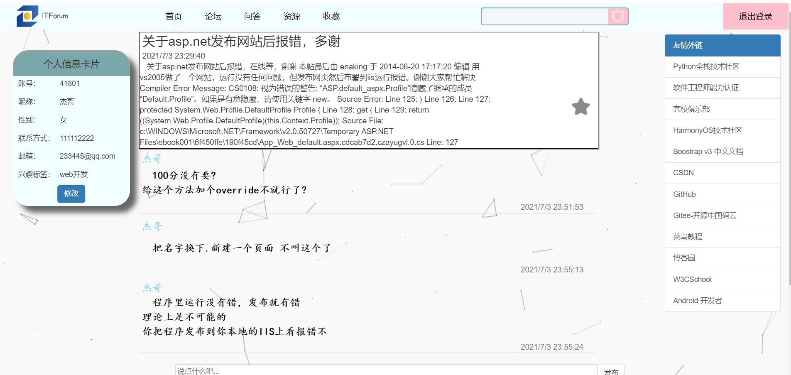

### “资源”页面
列表显示的文件由用户上传
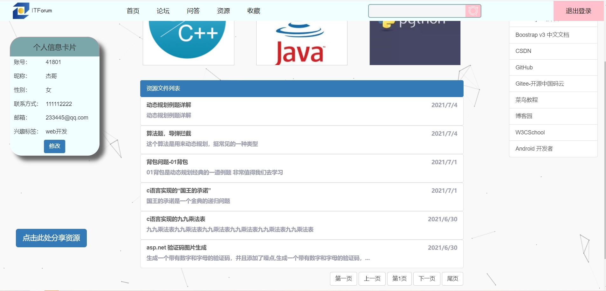

### 下载资源模态框
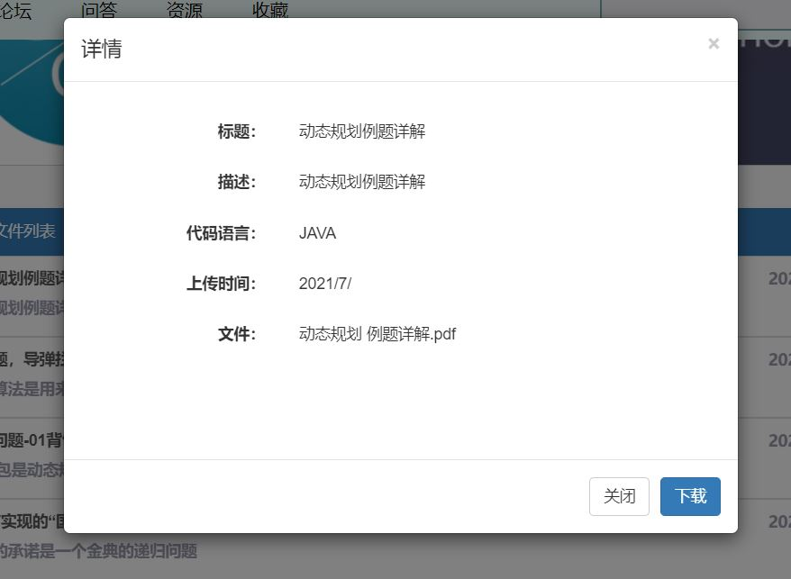

### 上传资源模态框
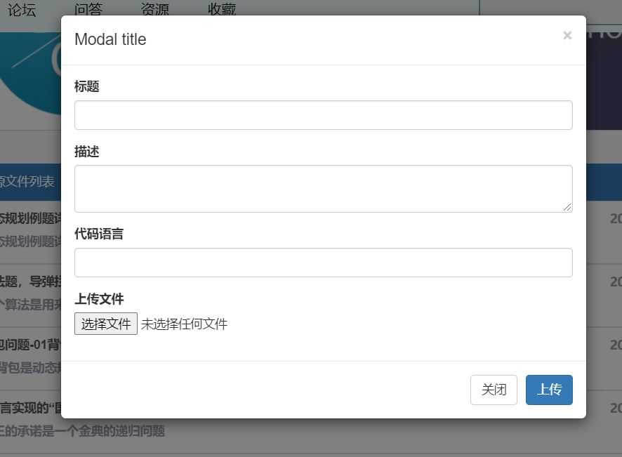

### “收藏”页面
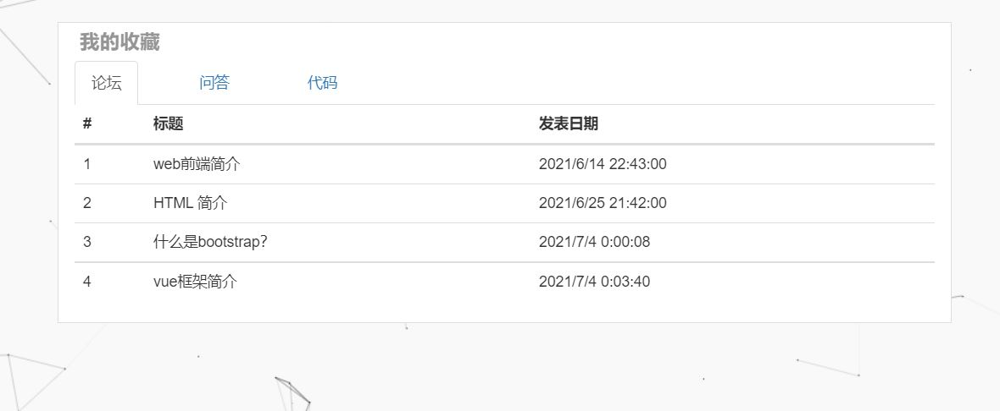

### 标签栏搜索框搜索结果
搜索内容：asp
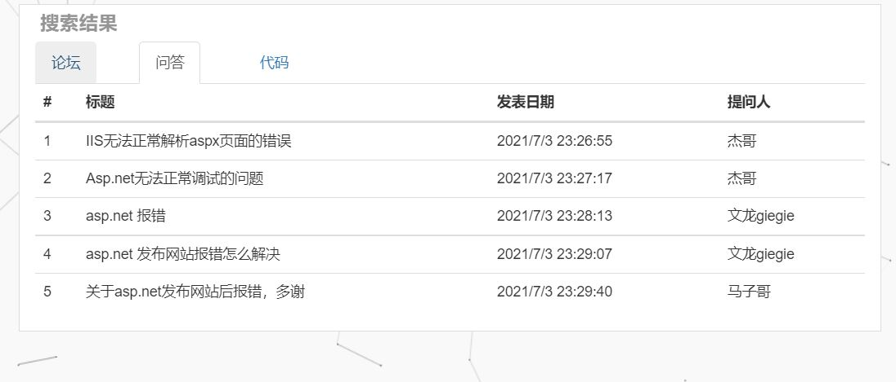

### 管理员登录
右侧隐藏条打勾
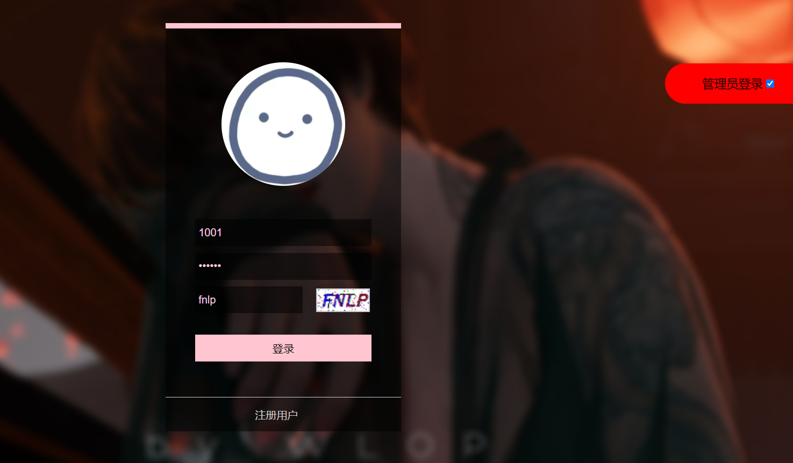

### 论坛文章发布
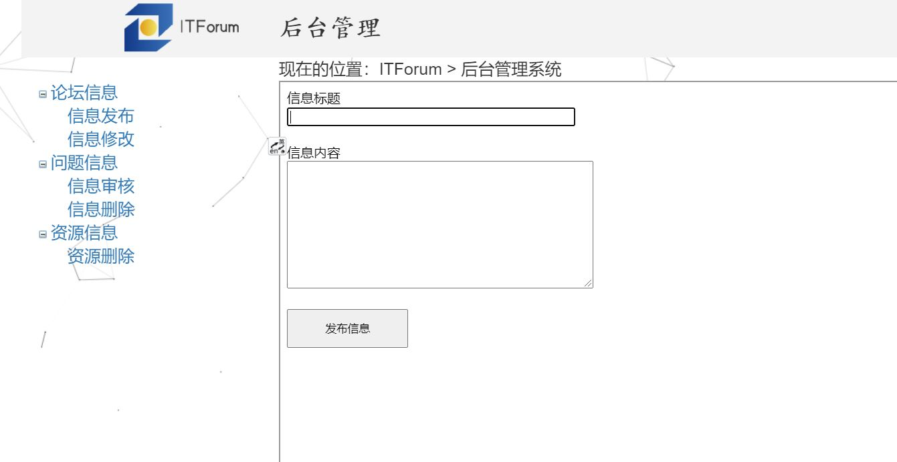

### 论坛文章修改
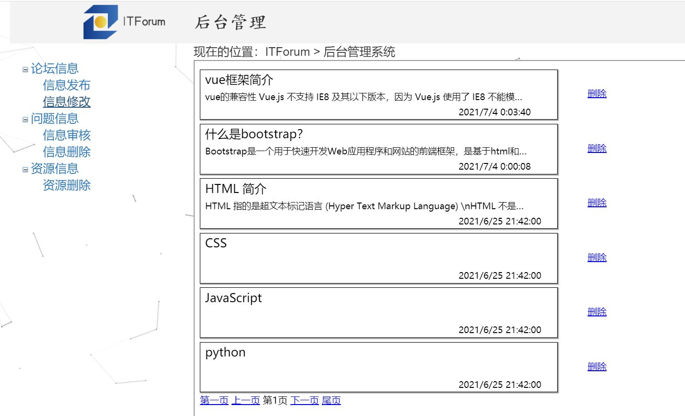

### 对用户发起的问答进行审核
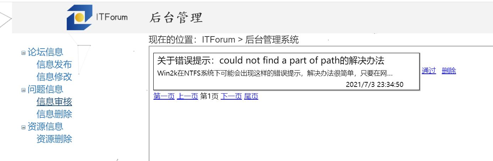

### 删除问答
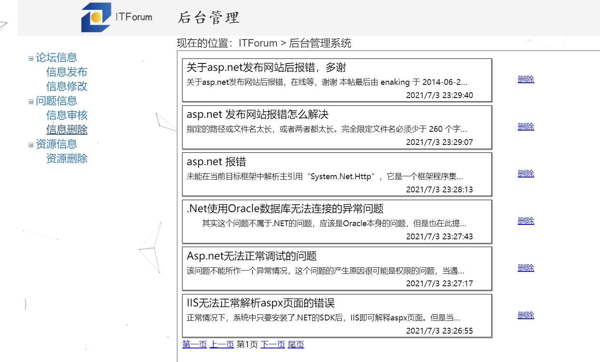

### 删除资源
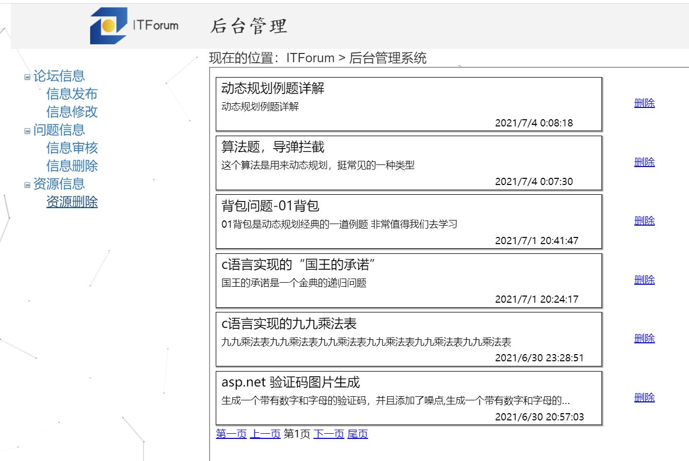
