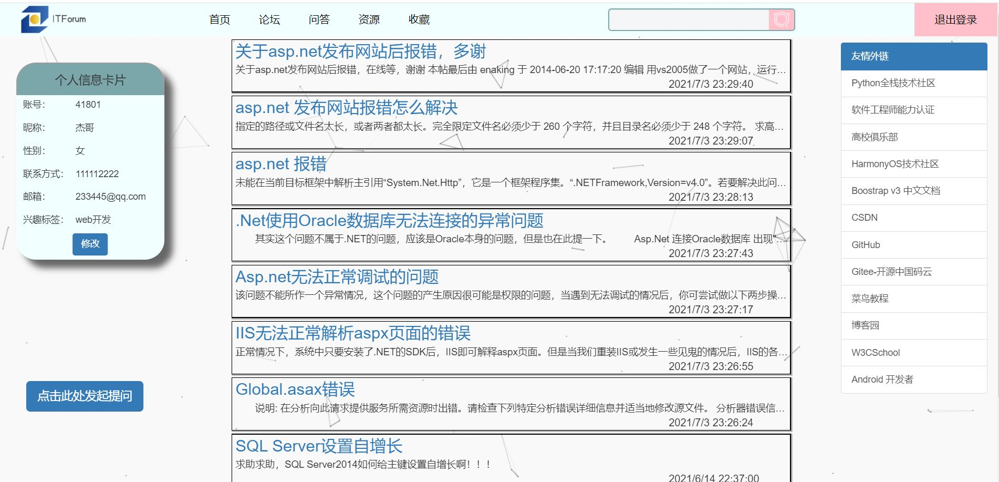

# Asp.net-ITForum
Asp.net个人作品，IT技术分享论坛

### 登录页面
验证码由代码生成，将结果放到session

### 注册页面

### 首页

### 修改个人信息（模态框）

### “论坛”页面

### “问答”页面

### 点击某个问答/论坛进入后的页面
可对问答/论坛进行点赞收藏、评论的操作

### “资源”页面
列表显示的文件由用户上传

### 下载资源模态框

### 上传资源模态框

### “收藏”页面

### 标签栏搜索框搜索结果
搜索内容：asp

